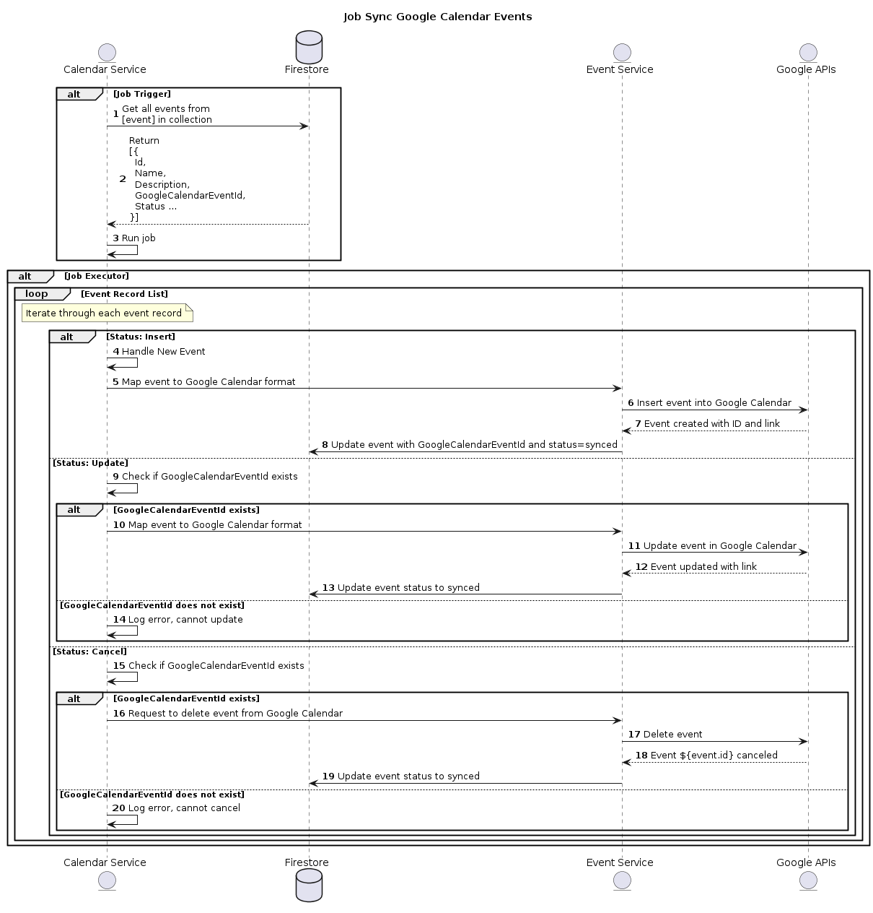
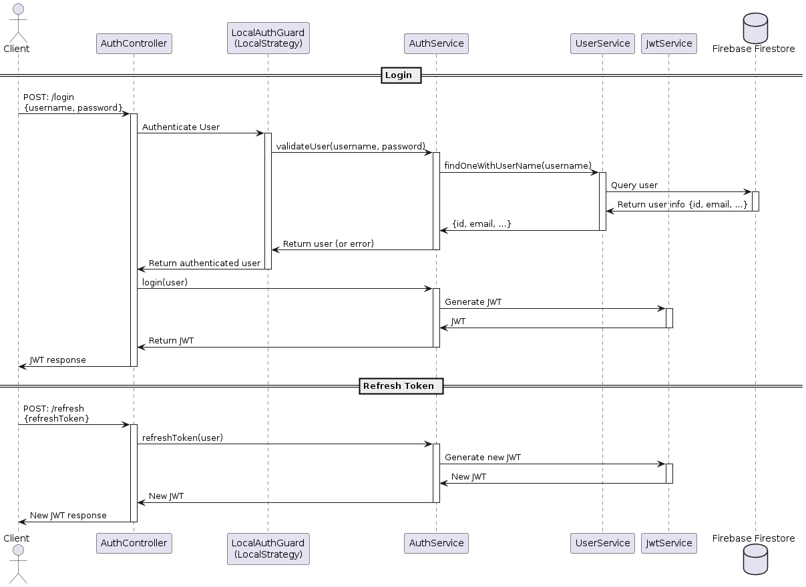

# Google Calendar Booking Backend

## Description
This project, 'google-calendar-booking-backend', is a backend service designed to provide custom apis to create/update/cancel booking events, and a schedule job which will automatic sync all the events on Google Calendar. It's built using the NestJS framework, hosting by Firebase functions and Firestore for database management.

## Features
- Authorization with custom APIs
- CRUD task for booking events
- Firebase schedule function
- Easy to integrate with existing Node.js applications

## Tech Stack
This project is built using a robust tech stack for optimal performance and scalability:

- **Backend Framework**: NestJS
- **Database**: Firestore
- **API Documentation**: Postman Collection
- **Code Formatting and Linting**: ESLint, Prettier
- **Logging**: Pino (nestjs-pino, pino-pretty)
- **Additional Libraries**:
  - moment for date/time management
  - class-trasformer/class-validate for validate API's params
  - firebase-admin/functions
  - googleapis for integration with Google Calendar
  - passport/passport-jwt/passport-local for authentication with JWT for custom APIs 
### Prerequisites
- Node.js v18.17.0
- Java >= version 11
- Firebase account
- Google developer account with 'https://www.googleapis.com/auth/calendar.readonly', 'https://www.googleapis.com/auth/calendar' added into your project
## Installation
To install the project, follow these steps:

```bash
git clone https://github.com/luongquoccuong2103/googleCalendar.git
cd calendar-api
npm install
```

## Environment Setup

To run this project, you will need to set up the following environment variables. You can do this by creating a `credentials.json` and `firebase-credentials.json` file in the root directory of the project and adding the following key-value pairs:
```plaintext
# credentials.json
{
  "web": {
    "client_id": "YOUR_CLIENT_ID",
    "project_id": "YOUR_PROJECT_ID",
    "auth_uri": "https://accounts.google.com/o/oauth2/auth",
    "token_uri": "https://oauth2.googleapis.com/token",
    "auth_provider_x509_cert_url": "https://www.googleapis.com/oauth2/v1/certs",
    "client_secret": "YOUR_CLIENT_SECRET",
    "redirect_uris": ["http://localhost:8000/google/redirect"]
  }
}


# firebase-credentials.json
{
  "type": "service_account",
  "project_id": "YOUR_PROJECT_ID",
  "private_key_id": "YOUR_PRIVATE_KEY_ID",
  "private_key": "YOUR_PRIVATE_KEY",
  "client_email": "YOUR_CLIENT_EMAIL",
  "client_id": "YOUR_CLIENT_ID",
  "auth_uri": "https://accounts.google.com/o/oauth2/auth",
  "token_uri": "https://oauth2.googleapis.com/token",
  "auth_provider_x509_cert_url": "https://www.googleapis.com/oauth2/v1/certs",
  "client_x509_cert_url": "YOUR_CLIENT_CERT_URL",
  "universe_domain": "googleapis.com"
}

```
## Sequence diagrams
### Sync Events Job


### Authentication JWT



## Usage
To start the application in firebase emulator mode:
```bash
npm run serve
```

To deploy the application for production:
```zsh
firebase deploy
```

To start the application in development mode:
```zsh
npm run start:dev
```

To build the application for production:
```zsh
npm run build
```


# Log Level : "fatal" | "error" | "warn" | "info" | "debug" | "trace"
default = trace
## API Documentation
### Firebase Emulator mode:
http://localhost:4000
### Firebase Production mode:
https://yourserverlocation-yourprojectname.cloudfunctions.net/yourfunctioname/


# Note
The Firebase schedule job will not run on emulator mode, you will need to deploy the project to your firebase schedule functions and checklogs. 
For alternative solution, i have created api "Sync Events" which will do all the task of the job. 

